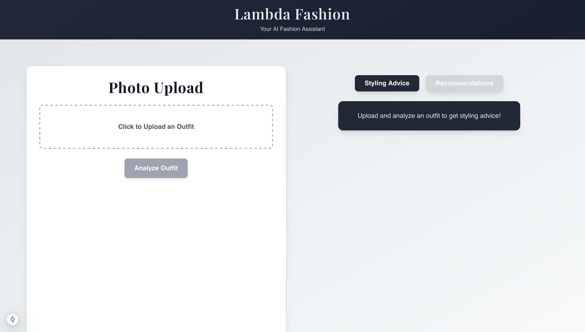
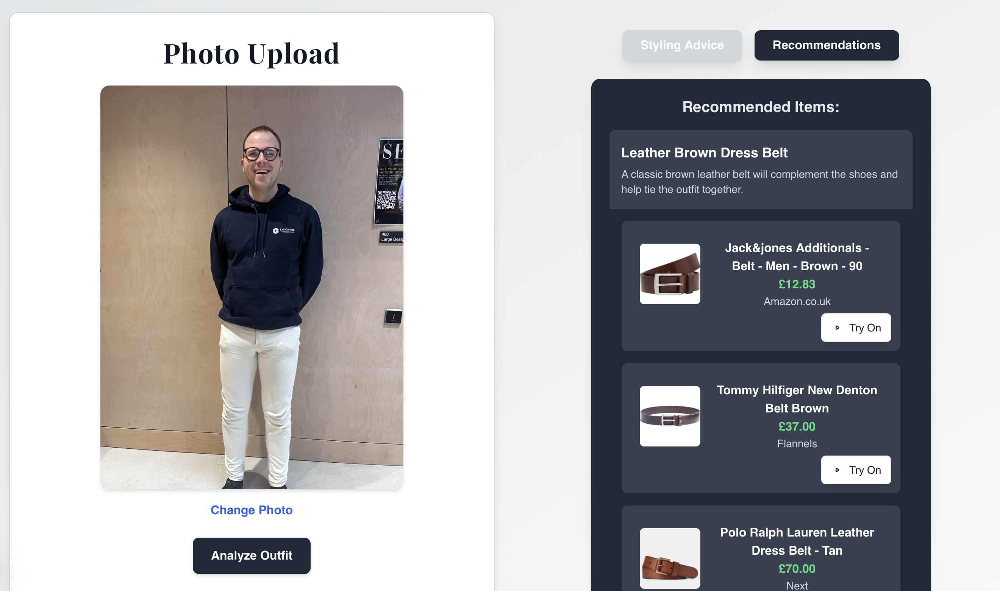

# Rate My Outfit - AI Fashion Assistant

An AI-powered fashion assistant that analyzes your outfits, provides styling advice, and suggests complementary clothing items.



## Project Overview
Check out our [presentation slides](supplementary/Lambda%20Fashion.gslides.pdf) for a walkthrough of the project and what we're trying to solve.

## Features

- 📸 Upload your outfit photos for instant analysis
- 👔 Get personalized styling recommendations
- 🛍️ Receive curated shopping suggestions
- 🎭 Virtual try-on for recommended items
- 🌐 UK-focused shopping results with GBP pricing



## Setup Instructions

### Prerequisites

- Node.js 18.17.0 or higher
- npm (Node Package Manager)
- Accounts/API keys for:
  - OpenAI
  - SERP API
  - FASHN.AI

### Installation

1. Clone the repository:
```bash
git clone [your-repo-url]
cd rate-my-outfit
```

2. Install dependencies:
```bash
npm install
npx playwright install chromium
```

3. Set up environment variables:

Create a `.env.local` file in the root directory with the following:
```env
OPENAI_API_KEY=your_openai_api_key    # Get from: https://platform.openai.com
SERP_API_KEY=your_serpapi_key         # Get from: https://serpapi.com
FASHN_API_KEY=your_fashn_ai_key       # Get from: https://fashn.ai
```

Note: You'll need to sign up for accounts at:
- OpenAI (for GPT-4 access)
- SerpAPI (for shopping recommendations)
- FASHN.AI (for virtual try-on feature)

### Development

Run the development server:
```bash
npm run dev
```

Open [http://localhost:3000](http://localhost:3000) to view the app.

### Production Deployment

1. Install Vercel CLI:
```bash
npm install -g vercel
```

2. Deploy to Vercel:
```bash
vercel login
vercel
```

3. Add environment variables in the Vercel dashboard:
   - Go to Project Settings > Environment Variables
   - Add the same variables as in `.env.local`

## Architecture


The application uses:
- Next.js 14 for the frontend and API routes
- OpenAI GPT-4 for outfit analysis
- SERP API for shopping recommendations
- FASHN.AI for virtual try-on
- Tailwind CSS for styling
- Framer Motion for animations

## License

MIT License

Copyright (c) 2024 Mark Finean, Adam Stones

Permission is hereby granted, free of charge, to any person obtaining a copy
of this software and associated documentation files (the "Software"), to deal
in the Software without restriction, including without limitation the rights
to use, copy, modify, merge, publish, distribute, sublicense, and/or sell
copies of the Software, and to permit persons to whom the Software is
furnished to do so, subject to the following conditions:

The above copyright notice and this permission notice shall be included in all
copies or substantial portions of the Software.

THE SOFTWARE IS PROVIDED "AS IS", WITHOUT WARRANTY OF ANY KIND, EXPRESS OR
IMPLIED, INCLUDING BUT NOT LIMITED TO THE WARRANTIES OF MERCHANTABILITY,
FITNESS FOR A PARTICULAR PURPOSE AND NONINFRINGEMENT. IN NO EVENT SHALL THE
AUTHORS OR COPYRIGHT HOLDERS BE LIABLE FOR ANY CLAIM, DAMAGES OR OTHER
LIABILITY, WHETHER IN AN ACTION OF CONTRACT, TORT OR OTHERWISE, ARISING FROM,
OUT OF OR IN CONNECTION WITH THE SOFTWARE OR THE USE OR OTHER DEALINGS IN THE
SOFTWARE.